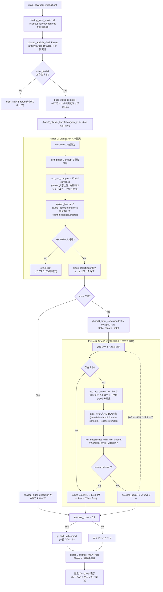
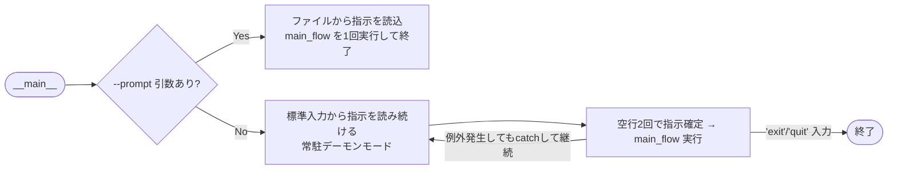

# `nazo_agent.py` ロジックマップ(オーケストレーター解剖)

> `nazo_agent.py`(713行)を読み解き、全関数・クラスの役割と実行フローを可視化したもの。Read-Only解析。

---

## 1. 全クラス・関数の役割リスト

### 設定・スキーマ
| 名前 | 種別 | 役割 |
|---|---|---|
| `BASE_DIR` / `TARGET_APP_DIR` / `TARGET_PYTHON` / `TARGET_CODE_DIR` | 定数 | オーケストレーター自身の場所・監視対象(`nazokake-evaluator/backend`)・そのvenv Python への絶対パスを定義。 |
| `AiderTask(BaseModel)` | クラス | Pydanticモデル。Claude APIの構造化出力(`file_path`, `instruction`)のスキーマ(現状Phase 2ではJSON手動パースで代用され、直接使用箇所は見当たらない=将来の`response_model`化用の下地)。 |

### ACD Engine(ログ圧縮・コンテキスト抽出) — Phase 1
| 関数 | 役割 |
|---|---|
| `acd_mask_noise(line)` | 時刻・16進・UUID・PIDなど「毎回変わるノイズ」を`<TIME>`等の記号に正規化する。 |
| `acd_phase1_dedup(error_log)` | マスク後に完全一致する連続行を`[Previous error repeated N times]`に圧縮する第一段階の重複排除。 |

### ACD Engine(AST精密抽出) — Phase 2 & 3
| 関数 | 役割 |
|---|---|
| `acd_extract_symbols(file_path)` | ファイル内の全クラス/関数名リストを返す(概要マップ用、浅い抽出)。 |
| `acd_extract_function_blocks(file_path)` | `ast.get_source_segment`で関数/クラス単位の`(開始行,終了行,名前,ソース全文)`を正確に抽出。 |
| `acd_find_enclosing_block(blocks, line_no)` | 指定行を含む最小(最も内側)のブロックを1つ選ぶ。 |
| `acd_parse_error_locations(log_text)` | リンター出力から `path:line: message` パターンを正規表現で全抽出。 |
| `_acd_format_block_section(...)` | 1ブロック分の出力(コードスニペット+検出メッセージ一覧)をMarkdownセクションに整形。ブロックが`ACD_MAX_BLOCK_CHARS`超なら省略。 |
| `acd_ast_compress(error_log, project_root, max_chars)` | **Phase 2用**。全findingsをファイル横断でブロック単位にグルーピングし圧縮。`max_chars`(既定15,000)超過分はセクション単位で安全に切り捨て。 |
| `acd_ast_context_for_file(deduped_log, target_file)` | **Phase 3用**。単一ファイルに関するfindingsだけを抜き出し、同様にブロック単位で整形(Aiderへの追加コンテキスト)。 |
| `build_static_context()` | 監視対象ディレクトリ全体を`rglob`し、各ファイルのシンボル一覧を`audit_reports/static_context.md`に書き出す(Aiderの`--read`用の全体地図)。 |

### One-Command Boot(ローカル環境の自動起動) — V8.5/V8.8
| 関数 | 役割 |
|---|---|
| `check_http_alive(url, timeout)` | 汎用ヘルスチェック(200番台で生存判定)。 |
| `check_ollama()` | `check_http_alive`の薄いラッパー(Ollama `/api/tags`)。 |
| `_ensure_service_alive(...)` | **汎用起動保証ヘルパー**。生存確認→(死んでいれば)`subprocess.Popen`でデタッチ起動(UTF-8 env付与、出力はログファイルへ)→最大15回×2秒ポーリング→タイムアウト時は警告+ログパス提示。例外は`try/except`で握り、呼び出し元をクラッシュさせない。 |
| `_warn_if_boot_evaluator_ps1_exists()` | レガシー起動スクリプト`boot_evaluator.ps1`の残存を警告するだけ(削除はしない)。 |
| `startup_local_services()` | Ollama→Backend(FastAPI:7800)→Frontend(dev_server:7300)の順に`_ensure_service_alive`を呼び、最後にレガシー警告を出す**Pre-flightの本体**。 |

### 可観測性・Phase 1(静的解析)
| 関数 | 役割 |
|---|---|
| `_progress_dots(message, stop_event)` | 長時間処理中に「...」を打ち続けるプログレス表示。 |
| `run_linter(tool_name)` | `ruff`/`mypy`/`bandit`/`radon`のいずれか1つを対象ディレクトリに対して実行し、Markdown断片を返す。60秒タイムアウト付き。 |
| `phase1_audit(is_final)` | 4種のリンターを`asyncio.gather`で並列実行し、結果を結合して`error_log.txt`(または`final_error_log.txt`)に保存。 |

### Phase 2(Claude API翻訳)
| 関数 | 役割 |
|---|---|
| `phase2_claude_translation(user_instruction, error_log_path)` | 生ログを読み込み→`acd_phase1_dedup`→`acd_ast_compress`で圧縮→Claude API(`system_blocks`に`cache_control:ephemeral`でキャッシュ)へ送信→JSON応答をパースし`triage_result.json`へ保存。失敗時は`sys.exit(1)`。 |

### Phase 3(Aiderによる自動修正)
| 関数 | 役割 |
|---|---|
| `_drain_stream(stream, buffer, activity)` | サブプロセスの1ストリームを読み続け、最終活動時刻を更新するコルーチン。 |
| `run_subprocess_with_idle_timeout(process, idle_timeout)` | stdout/stderrを並行ドレインしつつ、一定時間(既定300秒)無出力ならプロセスを強制終了する監視ループ。 |
| `phase3_aider_execution(tasks, deduped_error_log, static_context_path)` | タスクを1件ずつ順番に処理: 対象ファイル存在確認→`acd_ast_context_for_file`でエラーコンテキスト付与→`aider`をサブプロセス起動→アイドルタイムアウト監視→失敗したら**即サーキットブレーカーでbreak**(後続タスクは一切実行しない)。 |

### 全体制御
| 関数 | 役割 |
|---|---|
| `main_flow(user_instruction)` | `.env`読込→APIキー検証→`startup_local_services`→Phase1→静的コンテキスト生成→Phase2→Phase3→(成功時)Gitで一括コミット→Phase1再監査(Phase4)、という**自己修復パイプライン全体の指揮**。 |
| `__main__`ブロック | CLI引数`--prompt`があればバッチモード(1回実行して終了)、無ければ標準入力から指示を読み続ける常駐デーモンモードとして`main_flow`を繰り返し呼ぶ。 |

---

## 2. `startup_local_services` と `acd_*` の関係

**両者に直接の呼び出し関係はない。** `acd_*`群(ログ圧縮系)は`phase2_claude_translation`/`phase3_aider_execution`からのみ呼ばれ、`startup_local_services`(起動系)は`main_flow`の冒頭で一度だけ呼ばれる、完全に独立したサブシステムである。

つながりは**実行順序**のみ:
```
main_flow()
 ├─ 1. startup_local_services()   … ローカル環境(Ollama/Backend/Frontend)を稼働状態にする
 └─ 2. phase1_audit() 以降        … 稼働した環境に対して静的解析→acd_*で圧縮→Claude/Aiderで修復
```
つまり `startup_local_services` は「解析対象を診断可能な状態に整えるための前提条件」であり、`acd_*` はその後段で生成された巨大なログを、AST精密抽出によってAPIに渡せるサイズまで圧縮する役割を担う。両者は「環境系」と「データ圧縮系」という別レイヤーの関心事。

---

## 3. Phase 1→3「自己修復パイプライン」の実行条件とデータフロー

### 実行条件(ゲート)
- Phase 1→2: `phase1_audit`が返す`log_path`が存在しなければ`main_flow`はそこで`return`(Phase 2以降は実行されない)。
- Phase 2→3: `phase2_claude_translation`が例外を投げた場合は`sys.exit(1)`(プロセス自体が終了、Phase 3には進まない)。`tasks`が空リストなら`phase3_aider_execution`は即0件でスキップ。
- Phase 3内: 1タスクでも「対象ファイルなし」「Aider異常終了」「アイドルタイムアウト」「その他例外」が起きると**即break**(サーキットブレーカー)。以降のタスクは一切実行されない。
- Phase 3→コミット: `success_count > 0 and successful_files`のときのみGit `add`+`commit`を実行。

### データフロー(どこでAider/Claudeが呼ばれるか)



### 補足: Claude APIとAiderの呼び出し箇所
- **Claude API**: `phase2_claude_translation`内、`client.messages.create(...)`(1箇所のみ)。プロンプトキャッシュ(`system_blocks`への`cache_control:ephemeral`)を維持したまま、圧縮済みエラーログ(`compact_context`)を`messages`に渡す。
- **Aider**: `phase3_aider_execution`内、`asyncio.create_subprocess_exec(*cmd, ...)`(`cmd[0] == "aider"`)。タスクごとに1プロセスを起動し、`--cache-prompts`でAider側の独自キャッシュも併用。Claude呼び出しはPhase2で1回のみ、Aider呼び出しはPhase3でタスク数分(最大)発生する。

---

## 4. 常駐モードとバッチモードの分岐



`main_flow`内で発生する回復不能な失敗(APIキー欠如、Phase2 JSON解析失敗)は`sys.exit(1)`で**プロセスそのものを終了**させるため、バッチモードではそこで終わるが、常駐デーモンモードでは`__main__`の`try/except`が`SystemExit`ではなく汎用`Exception`のみを捕捉している点に注意(`sys.exit`は`SystemExit`を発生させるため、実際には常駐ループも終了してしまう可能性がある — コード上の細部として記録)。

## 5. アーキテクト (Gem) による評価と潜在的脆弱性

Read-Only解析と人間のインサイトにより、以下の重要なアーキテクチャ上の仕様と脆弱性が特定された。

1. **サブシステムの結合度（独立性の確認）**
   起動系（`startup_local_services`）と圧縮系（`acd_*`）は完全に分離されており、実行順序のみで依存している。これは将来的なリファクタリング（例：起動プロセスの別モジュール化や切り離し）が極めて容易であることを示す良好な設計である。
2. **サーキットブレーカーの挙動（フェイルファストのトレードオフ）**
   Phase 3（Aider修復）において、1つのタスク失敗で即座に `break` する設計になっている。これは二次被害（誤ったコンテキストでの連続修正）を防ぐ安全な設計だが、独立した複数ファイルのエラー修復が途中で打ち切られるという可用性とのトレードオフを生んでいる。
3. **【クリティカル】デーモンプロセスの脆弱性（SystemExitの捕捉漏れ）**
   常駐デーモンモードの例外捕捉が `except Exception:` となっているため、Phase 2 の致命的エラー処理等で呼ばれる `sys.exit(1)`（`BaseException` 派生の `SystemExit` を送出）を捕捉できない。結果として「常駐を意図したデーモンプロセスがクラッシュして終了する」という設計意図と実装の重大な乖離（バグ）が潜んでいる。今後の最優先修正事項とする。
