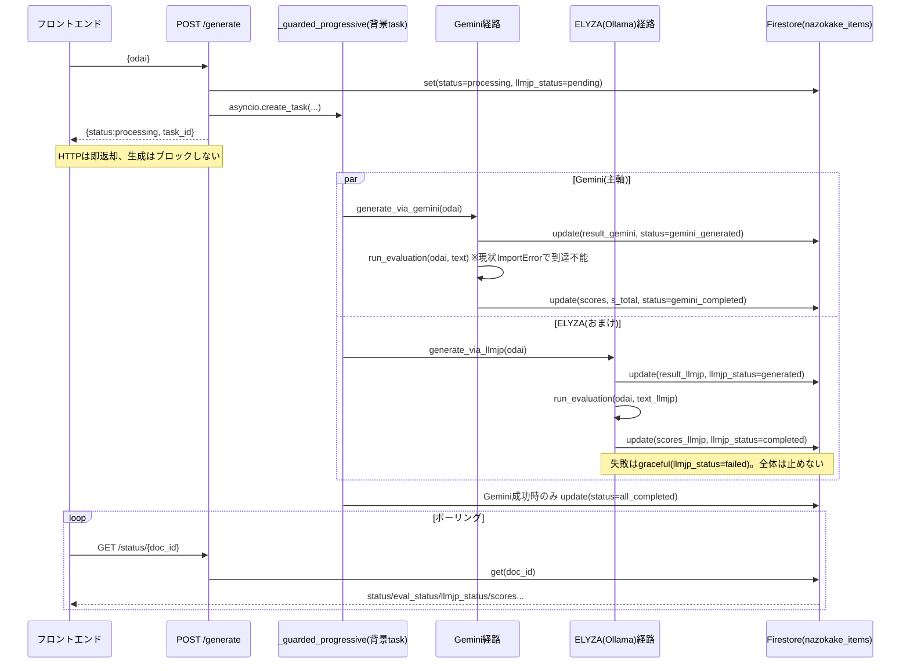
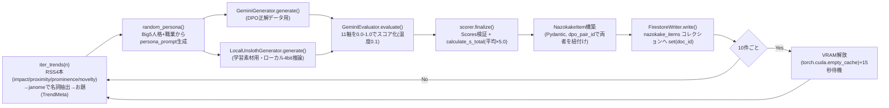
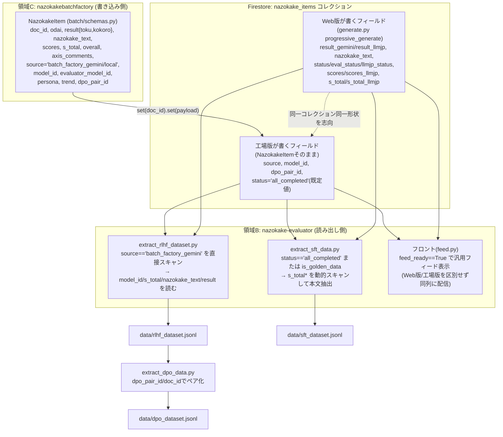

# アプリ本体(領域B)とバッチ工場(領域C)のコアロジックマップ

> `nazokake-evaluator`(領域B)と`nazokakebatchfactory`(領域C)の実ソースを読み解いたRead-Only解析。
> `project_structure_map.md`(構造)・`agent_logic_map.md`(オーケストレーター)に続く第3のドキュメント。

---

## 1. 領域B: なぞかけ生成のリクエスト〜レスポンスフロー

`backend/api/routers/generate.py` + `backend/services/generation.py` の実装に基づく。**生成と評価を意図的に分離し、Gemini(主軸・信頼パス)とELYZA/Ollama(おまけ・ベストエフォート)を完全並行実行する設計**。

補足:
- `_compose_text`が「「{odai}」とかけて、「{toku}」と解く。その心は、{kokoro}」」形式の本文を組み立てる(領域Cの`build_nazokake_text`と文言互換)。
- `generation.py`の生成本体は、Dynamic Few-Shot(固定の完全例1件+プールから毎回ランダム3件)を注入したCoTプロンプトで`associations→kakekotoba→shared_essence→surprise_check→toku→kokoro`の順にJSONを埋めさせ、`output_parser`で抽出・検証する。Gemini側は3回リトライ、ELYZA側はVRAM保護のため`Semaphore(1)`で同時実行数を1に制限。

---

## 2. 領域B: 評価機能の現状(バグの事実)

`backend/services/evaluation.py`には評価に必要な**材料(`AXES`の11軸定義、`EVAL_SCHEMA`、`EVAL_RUBRIC_TEMPLATE`)は揃っている**が、それらを使ってGemini APIを呼び出し`{scores, s_total, axis_comments, overall}`を返す**`run_evaluation`関数そのものが実装されていない**(トップレベル関数なし)。

一方、`generate.py`は`from services.evaluation import run_evaluation`をモジュールレベルでimportしている。これは「フロントエンドが評価結果をバイパスして受け取れない」という穏やかな話ではなく、**`generate`ルーターの読み込み自体が`ImportError`で失敗し、アプリ全体(FastAPI起動)がその時点で起動不能になる**という致命的な事実である(前回セッションで`fastapi run`を実機起動して`ImportError: cannot import name 'run_evaluation' from 'services.evaluation'`のトレースバックを直接確認済み)。したがって現状、フロントエンドは「AI評価」機能そのものに到達できず、バックエンド自体が立ち上がらない。

これと明確に区別すべきなのが `backend/api/routers/feed.py` の `POST /feed/evaluate/{doc_id}` である。これは**AI評価とは無関係な「人間による手動採点・添削」機能**で、`human_evaluations`/`human_comments`配列に`firestore.ArrayUnion`で追記し、`is_user_edited=True, feed_ready=False`にするだけ。命名が似ているため混同しやすいが、`run_evaluation`(AI・11軸自動採点)とは実装的に完全に独立している。

---

## 3. 領域B: ETL 3スクリプトのデータフロー(`backend/scripts/`)

いずれも`nazokake_items`コレクション(場合により`telemetry_logs`も)を読み出し元とする。

| スクリプト | 入力(読み出し) | 抽出条件 | 出力形式 |
|---|---|---|---|
| `extract_rlhf_dataset.py` | `telemetry_logs`(`event_name`が`gen_eval:*`の差分イベント) + `nazokake_items`(バルクフェッチ)。加えて`is_golden_data==True`または`source=="batch_factory_gemini"`のドキュメントを**直接スキャン**。 | テレメトリの評価イベントとdoc本文をJOIN。直接スキャン分は領域C生成物(`source=="batch_factory_gemini"`)由来を`data_source:"batch_direct"`、Web版Golden由来を`"golden_direct"`として区別。 | `data/rlhf_dataset.jsonl`(1行1サンプル: `odai/model/text/score/score_type/doc_id/dpo_pair_id/...`) |
| `extract_sft_data.py` | `nazokake_items`全量。`is_golden_data`/`is_approved`(手動承認、閾値4.0)、または`status==2`(Web版)/`status=="all_completed"`(工場版、閾値4.1)。 | ドキュメント内の`s_total`で始まる全キーを動的スキャンし、モデルごと(`s_total`, `s_total_llmjp`等)に本文を抽出。 | `data/sft_dataset.jsonl`(chat形式: `system/user/assistant`の3msgs) |
| `extract_dpo_data.py` | `data/rlhf_dataset.jsonl`(=`extract_rlhf_dataset.py`の出力。Firestoreを直接読まない) | `dpo_pair_id`または`doc_id`でグルーピングし、同一グループ内でスコアが異なるペアを全組み合わせ生成、スコア差上位5件のみ採用(過学習防止)。 | `data/dpo_dataset.jsonl`(`prompt/chosen/rejected`) |

3スクリプトは`RLHF抽出→DPO抽出`の順に依存する(DPOはRLHFの出力ファイルを消費する)一方、`SFT抽出`はFirestoreに対して独立に実行される。

---

## 4. 領域C: バッチ生成パイプライン(`batch/main.py`)

**重要な発見(ミッション記載の想定との相違)**: `batch/main.py`は`firestore_writer`/`gemini_evaluator`/`llm_client`/`persona`/`scorer`/`schemas`/`shutdown`/`trends`のみをimportしており、**`rag_retriever.py`を一切importしていない**。つまり「RAG検索」ステップは現行の生成パイプラインには結線されていない死んだモジュールであり、実際の生成多様性は`few_shots.py`の静的お手本プールからのランダム抽出(`_build_few_shot_text`, 毎回3件)のみで担保されている。今後仕様書を書く際はRAGを「実装済み機能」として記載しないよう注意が必要。

同一`trend`/`persona`・共通`dpo_pair_id`でGemini→LocalUnslothの順に連続処理することで、後段の`extract_dpo_data.py`が使う選好ペアを**生成時点で意図的に紐付けている**点が設計上の核。

---

## 5. 領域B×C接点: Firestoreスキーマ対応とデータのライフサイクル

領域Bと領域Cのコードは互いを一切importしない。接点は**`nazokake_items`コレクションのフィールド名という「規約」のみ**であり、静的解析では検知できない疎結合構造になっている(`project_structure_map.md`の気づき3.と同一の論点を、実際のフィールド単位で裏付けたもの)。

**データのライフサイクル**: 領域C(バッチ)または領域B(Web版ユーザー操作)のどちらかが`nazokake_items`に1件書き込む → 同じコレクションを両ドメインが共有(フィールド名の規約でのみ整合) → `feed.py`がWeb版/工場版を区別せず同列にフィード配信 → `backend/scripts`のETL群が定期的に全量/差分スキャンし、SFT/DPO/RLHF向けの学習データセット(`.jsonl`)へ変換 → (このリポジトリの範囲外だが)`nazokakebatchfactory`側のUnslothトレーナー群がこれらを消費して次の学習ラウンドに回る、という循環構造になっている。この循環の唯一の「契約書」が`batch/schemas.py`の`NazokakeItem`だが、Web版側(`generate.py`)はこのPydanticモデルを一切importせず、辞書リテラルで独自にフィールドを書いているため、**双方が同時に同じ意図でフィールド名を変更しない限り整合が保たれる、という暗黙の前提の上に成立している**。

## 6. アーキテクト (Gem) による最終評価とリファクタリングの優先度

領域Bと領域Cのコアフロー解析から、以下の重大な課題（技術的負債）と、それを解消するためのリファクタリングの優先順位が確定した。

**【優先度: 高 (Critical - アプリ起動阻害の解消)】**
1. **`run_evaluation` の実装（または安全なバイパス）**
   - 領域Bの `backend/services/evaluation.py` に `run_evaluation` 関数が存在しないことで、FastAPIバックエンド全体が起動不能（`ImportError`）になっている。直ちにダミー関数を実装して起動を確保するか、正しいAI評価ロジックを実装する必要がある。
2. **デーモンプロセスの SystemExit 捕捉漏れ修正**
   - `nazo_agent.py` の常駐デーモンループにおいて、`except BaseException:` を使用し、`sys.exit(1)` による意図せぬプロセスダウンを防ぐ。

**【優先度: 中 (アーキテクチャの健全化)】**
3. **Firestore スキーマ（契約）の共通化**
   - 領域B（Web版）と領域C（バッチ工場版）で共通のデータ契約（Pydanticモデル）が存在しない。`batch/schemas.py` を共通ライブラリ化（あるいは領域Bへ移植）し、Web版も辞書リテラルではなく型安全なモデル経由で書き込むように統一する。
4. **DRY原則違反の解消（`run_auditor.py`）**
   - 各領域に散らばる同一の監査スクリプトを単一のモジュールに統合する。

**【優先度: 低 (機能の整理とクリーンアップ)】**
5. **デッドコード（`rag_retriever.py`）の処遇**
   - RAG検索機能がバッチパイプライン（`main.py`）に組み込まれていない。設計上不要であれば削除、必要であれば正しく結線する。
6. **BOM付きファイルの修正**
   - 領域Cのバッチスクリプト群からBOMを削除し、静的解析ツールとの互換性を確保する。
